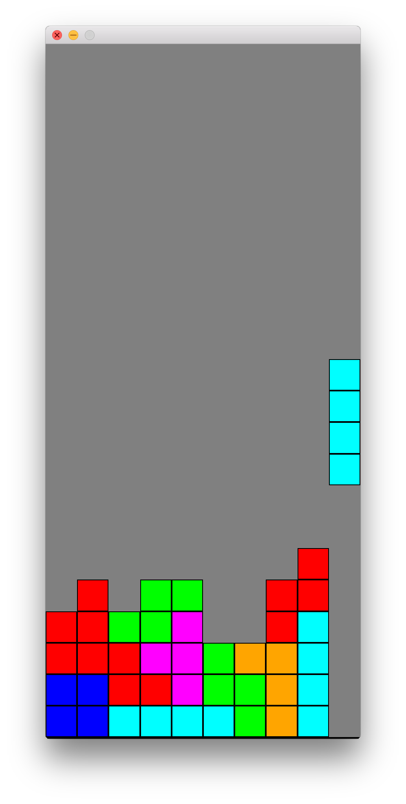

# Tetris



## Installation

You need [Homebrew](https://brew.sh/) installed.

```
# If you don't already have Ruby and Bundler, run this first:
brew install ruby
gem install bundler

# To install the dependencies of this game, run this:
brew install sdl2
bundle
```

https://github.com/gosu/gosu/wiki/Getting-Started-on-OS-X

## Play the game

Start the game with `bundle exec ruby tetris.rb`.

- <kbd>←</kbd> <kbd>→</kbd> <kbd>↓</kbd> <kbd>↑</kbd> control the falling piece
- <kbd>Esc</kbd> quits
